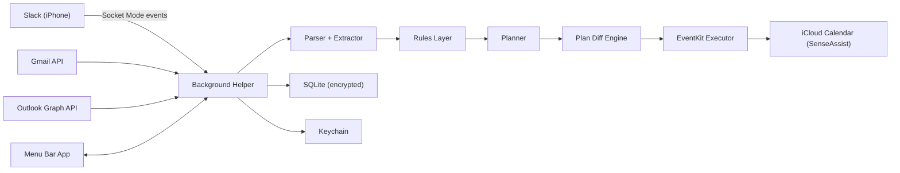

# PROJECT_SPEC_V2: SenseAssist

Version: 2.0  
Date: February 28, 2026  
Status: Implementation-ready architecture and delivery plan

---

## 1. Executive Summary

SenseAssist is a local-first macOS planning agent for students. It runs at login, ingests updates from Gmail/Outlook (including UB Learns and Piazza notifications received by email), extracts actionable tasks and deadlines, and converts them into a stress-aware daily plan written to Apple Calendar via EventKit.

The iPhone control surface is Slack. The Mac executes all heavy work: ingestion, parsing, LLM inference, validation, planning, and calendar writes.

Core principle:

- Slack is the remote control.
- Mac is the brain and execution boundary.
- LLM proposes; deterministic rules decide and enforce.

---

## 2. Product Goals and Non-Goals

## 2.1 Goals

- Launch-at-login background helper on macOS 13+.
- Continuous ingestion from Gmail and Outlook.
- Reliable task extraction from UB Learns/Piazza email notifications.
- Workload-aware planner that minimizes stress, not only deadline urgency.
- Calendar write-back to iCloud via EventKit.
- Slack-first control and feedback loop for iPhone use.
- Safe, auditable automation with undo and confirmation gates.

## 2.2 Non-Goals (MVP)

- No public web backend required for runtime operations.
- No direct UB Learns or Piazza API integrations (email notifications are source of truth).
- No editing of non-agent calendar events by default.
- No autonomous action when extraction confidence is below threshold.

---

## 3. Design Principles

1. Deterministic execution boundary  
   LLM can extract/suggest, but only deterministic code can modify stateful systems (calendar, DB, side effects).

2. Safety over convenience  
   Ambiguity triggers confirmation, not guessing.

3. Local-first privacy  
   Keep sensitive data on-device, minimize retained raw email content, encrypt local storage.

4. Idempotency and auditability  
   Every ingestion and mutation is repeat-safe and logged.

5. Resilience and fallback  
   Slack is primary UX, but local menu bar controls must support recovery.

---

## 4. Users and Primary Flows

## 4.1 Primary user

- University student managing assignments, quizzes, responses, applications, coding practice, and admin tasks.

## 4.2 Flow A: Interactive planning (Slack -> Calendar)

1. Student sends `/plan` command in Slack.
2. Socket Mode event reaches background helper.
3. LLM converts command into strict `EditOperation` JSON.
4. Rules layer validates operation, checks ambiguity and revision consistency.
5. Event executor applies update to agent-managed calendar blocks.
6. Slack confirmation with what changed and how to undo.

## 4.3 Flow B: Background ingestion (Email -> Tasks -> Plan -> Calendar)

1. Helper runs periodic sync.
2. Gmail and Outlook adapters fetch new messages incrementally.
3. Parser pipeline produces normalized `UpdateCard`s.
4. Extractor creates/updates `Task`s with confidence and provenance.
5. Planner computes feasible schedule under stress constraints.
6. Diff engine applies changes to EventKit blocks.
7. Slack digest summarizes updates.

---

## 5. External Dependencies and Ground Truth APIs

## 5.1 Slack

- Socket Mode WebSocket for Events API and interactive payloads.
- Slash commands (`/plan`) and optional message actions.
- No public HTTP endpoint required for inbound event delivery.

## 5.2 Gmail API

- `users.messages.list` for incremental ID discovery.
- `users.messages.get` for full message retrieval.
- Cursor strategy: `internalDate` + message ID tie-breaker.

## 5.3 Microsoft Graph (Outlook)

- `GET /me/messages` with `$select`, `$orderby`, and date filters.
- Cursor strategy: `receivedDateTime` + message ID tie-breaker.

## 5.4 EventKit

- `EKEventStore` for event CRUD.
- Calendar permission via modern EventKit authorization APIs for target macOS versions.
- Writes constrained to dedicated agent calendar by default.

## 5.5 ServiceManagement

- `SMAppService` for launch-at-login helper registration/control on macOS 13+.

---

## 6. Runtime Architecture

## 6.1 Process topology

- `SenseAssist Menu App` (foreground utility):
  - Onboarding and account linking.
  - Permission requests.
  - Settings and health status.
  - Recovery controls (pause/resume/force sync/reconnect).

- `SenseAssist Helper` (launch-at-login background):
  - Socket Mode connection.
  - Ingestion scheduler.
  - Parser/LLM/planner pipelines.
  - EventKit write executor.
  - DB state manager.

## 6.2 Component diagram



## 6.3 Trust boundaries

- Untrusted: inbound email bodies, Slack free-text commands.
- Semi-trusted: provider metadata (sender domain, message IDs).
- Trusted execution boundary: rules layer + executor + DB transactions.

---

## 7. Module Specifications

## 7.1 Slack Module

Responsibilities:

- Maintain Socket Mode connection with reconnect strategy.
- Parse slash commands and interactive actions.
- Route command text to LLM edit parser.
- Return confirmations, clarification prompts, and summaries.

Key behaviors:

- Ack inbound command quickly, process async if needed.
- Detect stale operation vs current `plan_revision`.
- Always include operation ID and undo hint in success response.

Example commands:

- `/plan today`
- `/plan add "LeetCode" 60m tonight`
- `/plan move "CSE312 A2" tomorrow 7pm`
- `/plan lock sleep 00:30-08:00`
- `/plan undo`

## 7.2 Ingestion Scheduler

Responsibilities:

- Drive periodic provider sync.
- Adaptive polling:
  - Active state: 5-10 min.
  - Normal state: 15 min.
  - Idle state: 30-60 min.
  - Error backoff: exponential with jitter.

Rules:

- Keep per-provider cursor and retry window.
- Never advance cursor if parse or persistence failed for fetched batch.
- Resume safely after sleep/offline periods.

## 7.3 Gmail Adapter

Responsibilities:

- Incremental fetch via list/get.
- Normalize message structure.
- Persist provider IDs for idempotency.

Data captured:

- `message_id`, `thread_id`, `internalDate`, sender, subject, body text, links.

## 7.4 Outlook Adapter

Responsibilities:

- Incremental fetch via Graph messages endpoint.
- Normalize to common provider-independent shape.
- Persist IDs and timestamps.

Data captured:

- `id`, `conversationId`, `receivedDateTime`, sender, subject, body preview/full text, links.

## 7.5 UB Learns + Piazza Email Parser

This parser stack is intentionally deterministic-first:

1. Source filter  
   Validate sender domain/address and expected link host patterns.

2. Template classifier  
   Classify message type from subject/header patterns:
   - assignment posted
   - due date reminder
   - quiz opened
   - digest summary
   - response required

3. Field extractor (rule-based)  
   Regex and structured extraction:
   - course code/name
   - assignment title
   - due date/time and timezone hints
   - required action terms (`reply`, `confirm`, `RSVP`)
   - canonical source links

4. Digest splitter  
   Split digests into atomic update entries before task creation.

5. LLM fallback extractor  
   Run only if deterministic extraction misses required fields.
   Must return strict JSON schema and confidence per field.

6. Validation gate  
   Reject malformed or low-confidence fields.
   If uncertain: create update requiring user confirmation, no auto scheduling.

## 7.6 LLM Runtime Module

Allowed responsibilities:

- Task extraction from sanitized text.
- Slack intent -> `EditOperation` JSON.
- User-facing summaries.

Forbidden responsibilities:

- No calendar writes.
- No direct DB mutation.
- No side-effect API calls.

Controls:

- JSON-only mode.
- Schema validation required.
- Prompt-injection defense: user/email text treated only as data.

## 7.7 Rules Layer (mandatory)

This module is the policy firewall between LLM output and execution.

Checks:

- Schema validity and required fields.
- `plan_revision` consistency.
- Ambiguity (multiple event candidates).
- Calendar safety (agent-managed only unless explicit confirmation).
- Constraint compliance (sleep lock, cutoff time, max deep work).
- Confidence thresholds for extracted tasks.

Outputs:

- `APPROVED`
- `REQUIRES_CONFIRMATION`
- `REJECTED_WITH_REASON`

## 7.8 Planner Engine

Inputs:

- task backlog with size, due dates, priority, min daily, stress weights.
- existing calendar commitments.
- user constraints and preferences.

Policy goals:

- Minimize overload and late risk.
- Spread large work early.
- Preserve recovery/free-space buffer.

Feasibility states:

- `on_track`
- `at_risk`
- `infeasible`

When infeasible:

- Do not silently overpack calendar.
- Return explicit alternatives (defer, reduce target minutes, ask user priority decision).

## 7.9 Plan Diff Engine

Responsibilities:

- Compare current plan revision vs proposed plan.
- Produce deterministic operations:
  - create block
  - move block
  - resize block
  - delete block (agent-managed only)

Outputs:

- human-readable summary for Slack.
- reversible operation set for undo.

## 7.10 EventKit Executor

Responsibilities:

- Read and write events in dedicated `SenseAssist` calendar.
- Enforce write policy and lock levels.
- Map local `block_id` <-> `ek_event_id`.

Safety:

- By default no mutation outside dedicated calendar.
- If user requests cross-calendar action, require explicit confirmation.

## 7.11 Storage Module

Responsibilities:

- SQLite transactional persistence.
- Migration management.
- Encryption at rest.
- Audit and operation history.

Security:

- OAuth/Slack tokens in Keychain only.
- DB stores sanitized/minimized content where possible.

## 7.12 Launch-at-Login Module

Responsibilities:

- Register helper with `SMAppService`.
- Expose UI toggle with status.
- Validate helper health and restart behavior.

---

## 8. Data Contracts

## 8.1 Canonical UpdateCard

```json
{
  "update_id": "uuid",
  "source": "gmail|outlook|ublearns_email|piazza_email",
  "provider_ids": {
    "message_id": "string",
    "thread_id": "string|null"
  },
  "received_at_utc": "2026-02-28T18:00:00Z",
  "from": "string",
  "subject": "string",
  "body_text": "string",
  "links": ["string"],
  "tags": ["course:CSE312", "type:announcement"],
  "parser_method": "rule_based|llm_fallback",
  "parse_confidence": 0.0,
  "evidence": ["due phrase", "link match"],
  "requires_confirmation": false
}
```

## 8.2 Task

```json
{
  "task_id": "uuid",
  "title": "CSE312 Assignment 2",
  "category": "assignment|quiz|email_reply|application|leetcode|project|admin",
  "due_at_local": "2026-03-02T23:59:00-05:00|null",
  "estimated_minutes": 600,
  "min_daily_minutes": 120,
  "priority": 1,
  "stress_weight": 0.7,
  "feasibility_state": "on_track|at_risk|infeasible",
  "sources": [
    {
      "source": "gmail",
      "message_id": "18c1...",
      "confidence": 0.88
    }
  ],
  "status": "todo|in_progress|done|ignored"
}
```

## 8.3 CalendarBlock

```json
{
  "block_id": "uuid",
  "task_id": "uuid|null",
  "title": "Deep Work: CSE312 A2",
  "start_local": "2026-02-28T16:00:00-05:00",
  "end_local": "2026-02-28T18:00:00-05:00",
  "ek_event_id": "EventKitIdentifier",
  "calendar_name": "SenseAssist",
  "managed_by_agent": true,
  "lock_level": "flexible|locked",
  "plan_revision": 42
}
```

## 8.4 Slack EditOperation

```json
{
  "op_id": "uuid",
  "expected_plan_revision": 42,
  "intent": "create_block|move_block|resize_block|delete_block|lock_sleep|regenerate_plan|mark_done",
  "target": {
    "ek_event_id": "string|null",
    "fuzzy_title": "string|null",
    "date_local": "2026-02-28|null"
  },
  "time": {
    "start_local": "2026-02-29T19:00:00-05:00|null",
    "end_local": "2026-02-29T20:00:00-05:00|null"
  },
  "parameters": {
    "sleep_window": {
      "start": "00:30",
      "end": "08:00"
    },
    "min_daily_minutes": 120
  },
  "requires_confirmation": false,
  "ambiguity_reason": "string|null",
  "notes": "string"
}
```

## 8.5 PlanRevision

```json
{
  "revision_id": 42,
  "created_at_utc": "2026-02-28T18:12:00Z",
  "trigger": "background_sync|slack_command|manual_regenerate",
  "summary": {
    "created_blocks": 3,
    "moved_blocks": 1,
    "deleted_blocks": 0
  },
  "undo_operation_id": "uuid"
}
```

---

## 9. SQLite Schema (initial draft)

```sql
CREATE TABLE updates (
  update_id TEXT PRIMARY KEY,
  source TEXT NOT NULL,
  message_id TEXT NOT NULL,
  thread_id TEXT,
  received_at_utc TEXT NOT NULL,
  sender TEXT NOT NULL,
  subject TEXT NOT NULL,
  body_text TEXT,
  links_json TEXT NOT NULL,
  tags_json TEXT NOT NULL,
  parser_method TEXT NOT NULL,
  parse_confidence REAL NOT NULL,
  content_hash TEXT NOT NULL,
  requires_confirmation INTEGER NOT NULL DEFAULT 0,
  created_at_utc TEXT NOT NULL
);

CREATE UNIQUE INDEX idx_updates_provider
ON updates(source, message_id);

CREATE TABLE tasks (
  task_id TEXT PRIMARY KEY,
  title TEXT NOT NULL,
  category TEXT NOT NULL,
  due_at_local TEXT,
  estimated_minutes INTEGER NOT NULL,
  min_daily_minutes INTEGER NOT NULL,
  priority INTEGER NOT NULL,
  stress_weight REAL NOT NULL,
  feasibility_state TEXT NOT NULL,
  status TEXT NOT NULL,
  dedupe_key TEXT NOT NULL,
  created_at_utc TEXT NOT NULL,
  updated_at_utc TEXT NOT NULL
);

CREATE UNIQUE INDEX idx_tasks_dedupe ON tasks(dedupe_key);

CREATE TABLE task_sources (
  task_id TEXT NOT NULL,
  source TEXT NOT NULL,
  message_id TEXT NOT NULL,
  confidence REAL NOT NULL,
  PRIMARY KEY (task_id, source, message_id)
);

CREATE TABLE blocks (
  block_id TEXT PRIMARY KEY,
  task_id TEXT,
  title TEXT NOT NULL,
  start_local TEXT NOT NULL,
  end_local TEXT NOT NULL,
  ek_event_id TEXT NOT NULL,
  calendar_name TEXT NOT NULL,
  managed_by_agent INTEGER NOT NULL DEFAULT 1,
  lock_level TEXT NOT NULL,
  plan_revision INTEGER NOT NULL,
  created_at_utc TEXT NOT NULL,
  updated_at_utc TEXT NOT NULL
);

CREATE UNIQUE INDEX idx_blocks_event ON blocks(ek_event_id);

CREATE TABLE plan_revisions (
  revision_id INTEGER PRIMARY KEY AUTOINCREMENT,
  trigger TEXT NOT NULL,
  summary_json TEXT NOT NULL,
  created_at_utc TEXT NOT NULL
);

CREATE TABLE operations (
  op_id TEXT PRIMARY KEY,
  expected_plan_revision INTEGER,
  applied_revision INTEGER,
  intent TEXT NOT NULL,
  status TEXT NOT NULL,
  payload_json TEXT NOT NULL,
  result_json TEXT,
  created_at_utc TEXT NOT NULL
);

CREATE TABLE provider_cursors (
  provider TEXT PRIMARY KEY,
  cursor_primary TEXT NOT NULL,
  cursor_secondary TEXT,
  updated_at_utc TEXT NOT NULL
);

CREATE TABLE preferences (
  key TEXT PRIMARY KEY,
  value_json TEXT NOT NULL,
  updated_at_utc TEXT NOT NULL
);

CREATE TABLE audit_log (
  log_id TEXT PRIMARY KEY,
  category TEXT NOT NULL,
  severity TEXT NOT NULL,
  message TEXT NOT NULL,
  context_json TEXT NOT NULL,
  created_at_utc TEXT NOT NULL
);
```

---

## 10. Planning Algorithm Specification

## 10.1 Inputs

- Available scheduling windows (work hours minus existing commitments).
- Constraints:
  - sleep window (hard lock)
  - max deep-work per day
  - break policy
  - no-schedule-after cutoff
  - free-space buffer
- Task queue with:
  - due date
  - estimated size
  - min daily minutes
  - priority
  - stress weight

## 10.2 Heuristic strategy

1. Reserve hard constraints first (sleep, existing non-agent events, breaks, buffer).
2. Score tasks by urgency, size pressure, and priority:

   `score = urgency_weight + size_pressure + priority_weight - stress_penalty`

3. For large tasks due soon, allocate minimum daily commitment early.
4. Fill remaining windows with highest score tasks.
5. Evaluate feasibility:
   - if required minutes > available minutes in horizon -> `infeasible`.
6. Generate alternatives when infeasible:
   - reduce low-priority task allocation
   - suggest explicit deferral options
   - request user prioritization in Slack

## 10.3 Stress-aware rules

- Cap total deep work/day.
- Inject breaks after each focus interval.
- Avoid late-night scheduling after cutoff.
- Keep free-space buffer unscheduled.

---

## 11. Guardrails and Validation Rules

1. Time parsing  
   Parse all dates timezone-aware; store UTC and local representations.

2. Confidence thresholds  
   If extraction confidence below threshold:
   - no auto-schedule
   - create clarification request.

3. Dedupe  
   Dedupe key based on normalized:
   `course + title + due date + primary link`.

4. Idempotency  
   Provider message IDs and operation IDs prevent duplicate effects.

5. Calendar safety  
   Edit/delete only agent-managed events in dedicated calendar unless confirmed.

6. Ambiguity handling  
   If multiple possible targets, ask user to choose by indexed list.

7. Stale operation rejection  
   Reject edits with outdated `expected_plan_revision`.

8. Prompt-injection defense  
   Email body and Slack user text cannot override system policies.

---

## 12. Slack UX Contract

## 12.1 Response patterns

- Success: concise change summary + undo affordance.
- Clarification: quick options and example reply.
- Risk warning: explain why confirmation is required.
- Failure: actionable remediation steps.

## 12.2 Example confirmation prompt

`I found 2 matching blocks for "homework". Reply with 1 or 2:`

1. `Deep Work: CSE312 A2 (today 7:00-8:00 PM)`
2. `Deep Work: CSE331 HW3 (today 8:15-9:15 PM)`

## 12.3 Example success message

`Moved "Deep Work: CSE312 A2" to tomorrow 7:00-8:30 PM.`
`Plan revision: 57. Reply /plan undo to revert.`

---

## 13. Security, Privacy, and Compliance

## 13.1 Data protection

- Store OAuth and Slack tokens in macOS Keychain only.
- Encrypt SQLite database at rest.
- Store minimal email content needed for extraction/audit.
- Redact or hash sensitive body segments where possible.

## 13.2 Access scope minimization

- Request only necessary Gmail/Graph scopes.
- Calendar scope limited to event operations needed by product.

## 13.3 Threat model controls

- Prompt injection from email text: neutralized by strict parsing boundary.
- Token theft: minimized through Keychain and no plaintext token logs.
- Unauthorized mutation: constrained by rules layer and dedicated calendar ownership.

---

## 14. Reliability and Failure Modes

1. Mac offline/asleep  
   On wake: run catch-up sync using cursors and bounded replay window.

2. Slack disconnected  
   Attempt reconnect with backoff; show menu bar warning.

3. Calendar permission revoked  
   Stop writes, post Slack + local alert with remediation steps.

4. OAuth expiry/revocation  
   Pause provider pipeline and prompt reauth in menu bar.

5. Provider API errors/rate limits  
   Backoff with jitter and partial pipeline continuity.

6. Planner infeasible state  
   Report risk instead of forcing impossible schedule.

---

## 15. Observability and Audit

## 15.1 Structured logs

- Categories: `ingestion`, `parser`, `planner`, `calendar`, `slack`, `auth`.
- Include operation IDs, revision IDs, provider IDs, and duration metrics.

## 15.2 Metrics

- Sync latency and success rate by provider.
- Extraction precision proxy: confirmation-required frequency.
- Schedule feasibility ratio.
- Calendar apply failure rate.
- Slack command roundtrip time.

## 15.3 Audit requirements

- Every calendar mutation logs:
  - who/what triggered it
  - old/new values
  - revision id
  - confirmation context if applicable

---

## 16. Version and Compatibility Strategy

Supported baseline:

- macOS 13+ (Ventura and newer).

Compatibility requirements:

- EventKit permission API selection by OS version.
- ServiceManagement helper behaviors validated per supported OS.

Test matrix (minimum):

- macOS 13.x and latest available macOS.
- iCloud calendar enabled and disabled scenarios.

---

## 17. Implementation Strategy and Milestones

## 17.1 Milestone 0: Foundation

Deliverables:

- Project workspace and target setup (menu app + helper).
- Shared core module for contracts and DB models.
- Logging, migrations, and config system.

Exit criteria:

- Helper launches manually, DB initializes, basic health status visible.

## 17.2 Milestone 1: Slack + Calendar core

Deliverables:

- Slack Socket Mode connection.
- `/plan today`, `/plan add`, `/plan move`.
- EventKit read/write in dedicated `SenseAssist` calendar.
- Rules layer v1 and operation audit.

Exit criteria:

- End-to-end command edits calendar safely with undo.

## 17.3 Milestone 2: Gmail ingestion pipeline

Deliverables:

- Gmail incremental sync with cursor persistence.
- Parser pipeline + task extraction + dedupe.
- Planner integration for auto block generation.

Exit criteria:

- New actionable Gmail messages create/update tasks and plan blocks.

## 17.4 Milestone 3: UB Learns and Piazza email intelligence

Deliverables:

- Deterministic templates for common notification forms.
- Digest splitting and confidence gating.
- Slack confirmation flow for uncertain extraction.

Exit criteria:

- Academic notification emails produce reliable tasks.

## 17.5 Milestone 4: Outlook integration + adaptive scheduler

Deliverables:

- Graph incremental sync and cursoring.
- Unified provider arbitration and idempotent merges.
- Adaptive polling and robust backoff.

Exit criteria:

- Both providers run stably with no duplicate task generation.

## 17.6 Milestone 5: Hardening and user trust features

Deliverables:

- Full infeasible-plan handling.
- Plan preview + diff summary.
- Undo/redo resilience.
- Security hardening and data minimization controls.

Exit criteria:

- Production-ready reliability and safety posture.

---

## 18. Testing Strategy

## 18.1 Unit tests

- Parser rules per template.
- Time parsing and timezone conversions.
- Dedupe key generation.
- Planner heuristics and infeasibility detection.
- Rules layer decision outcomes.

## 18.2 Integration tests

- Slack command -> edit op -> EventKit apply.
- Gmail and Outlook incremental sync cursor correctness.
- Reconnect/offline recovery workflows.

## 18.3 End-to-end scenarios

1. Assignment posted with due date in email.
2. Digest with multiple tasks and mixed confidence.
3. Ambiguous move command.
4. Calendar permission revoked and restored.
5. OAuth token expired then reauthenticated.

## 18.4 Regression policy

- Any bug touching calendar mutation requires:
  - reproduction case
  - new regression test
  - audit log assertion.

---

## 19. Suggested Codebase Layout

```text
SenseAssist/
  Apps/
    SenseAssistMenuApp/
    SenseAssistHelper/
  Packages/
    CoreContracts/
    Storage/
    RulesEngine/
    Planner/
    LLMRuntime/
    Integrations/
      Slack/
      Gmail/
      Outlook/
      EventKitAdapter/
    ParserPipeline/
      SourceFilters/
      TemplateClassifiers/
      FieldExtractors/
      DigestSplitter/
  Docs/
    PROJECT_SPEC_V2.md
```

---

## 20. Open Decisions to Resolve Before Build Start

1. Preferred on-device LLM runtime stack and model size by hardware tier.
2. Exact Gmail and Graph OAuth scopes and consent UX text.
3. SQL encryption approach (library choice and key management flow).
4. User-configurable confidence threshold defaults.
5. Final Slack command set for MVP vs post-MVP.

---

## 21. Definition of Done (MVP)

MVP is complete when all conditions are met:

1. Helper starts automatically at login and stays healthy.
2. Slack `/plan today|add|move` works end-to-end.
3. Gmail ingestion is incremental and idempotent.
4. UB Learns/Piazza notification emails produce tasks with confidence gating.
5. Planner enforces sleep, stress, break, and cutoff constraints.
6. Calendar changes stay inside dedicated agent-managed calendar by default.
7. Every change is auditable and undoable.

---

## 22. One-Paragraph Project Pitch

SenseAssist is a local-first macOS planning agent that turns real student updates from Gmail, Outlook, UB Learns, and Piazza notifications into a realistic, low-stress schedule synced to iPhone through iCloud Calendar, while giving full control through Slack commands. It combines on-device LLM understanding with strict deterministic guardrails, feasibility-aware planning, safe calendar mutation boundaries, and full audit/undo support, so automation stays useful, transparent, and trustworthy.
