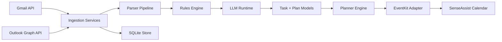

# SenseAssist

SenseAssist is a local-first macOS planning agent for students.

It turns Gmail and Outlook updates (including UB Learns/Piazza-style notification emails) into actionable tasks, then builds a realistic, stress-aware plan with deterministic safety rules before touching your calendar.

If this project is useful for your workflow or research, star the repo and fork it. Stars help discovery, and forks help the architecture evolve faster.

## Why this project is different

- Local-first runtime: parsing, planning, and execution run on your Mac.
- Safety-first automation: LLM output is validated by a rules layer before any state change.
- Stress-aware scheduling: planning accounts for deep-work limits, breaks, and free-space buffer.
- Fork-friendly architecture: clear Swift modules with targeted test coverage and minimal hidden magic.

## Product status (March 1, 2026)

Implemented and working in this repo:

- Multi-account Gmail and Outlook incremental sync with cursor persistence.
- Deterministic parser pipeline with sender trust checks, digest splitting, and confidence gates.
- Rules engine for stale revisions, ambiguity handling, and low-confidence extraction.
- Planner engine with feasibility states (`on_track`, `at_risk`, `infeasible`).
- EventKit-backed managed calendar writes with safe boundaries.
- Plan command service for `today`, `add`, `move`, and `undo`.
- SQLite persistence with migrations for updates, tasks, sources, accounts, cursors, and audit logs.
- LLM runtime options:
  - Ollama (default)
  - ONNX Runtime GenAI via `Scripts/onnx_genai_runner.py`

Still in progress:

- Full Slack Socket Mode command loop wired into the helper runtime.
- Menu bar onboarding and launch-at-login UX.
- End-to-end auth onboarding flow for new users (developer-oriented setup exists now).

## Architecture at a glance



Detailed architecture and milestone plan: [PROJECT_SPEC_V2.md](./PROJECT_SPEC_V2.md)

## Quickstart

### 1) Prerequisites

- macOS 13+
- Xcode command line tools with Swift 6
- `sqlite3` in `PATH` (optional, only needed for DB summary command)

### 2) Verify locally

```bash
swift test
make helper-health
make sync-all-demo
make db-summary
```

`swift test` currently runs 28 tests across planner, parser, rules, storage, ingestion, and orchestration modules.

### 3) Run plan command demo

```bash
swift run senseassist-helper --plan 'today'
swift run senseassist-helper --plan 'add "CSE312 Assignment" 90m tomorrow 7pm'
swift run senseassist-helper --plan 'move "CSE312 Assignment" tomorrow 8pm 60m'
swift run senseassist-helper --plan 'undo'
```

If Calendar permission is missing, the helper returns a remediation message instead of mutating anything.

## Live sync with Gmail/Outlook

Run once:

```bash
make sync-all-live
```

The helper loads OAuth access tokens from Keychain first, then from environment variables.

Environment key format:

```text
SENSEASSIST_TOKEN_<PROVIDER>_<ACCOUNT_ID_OR_EMAIL_NORMALIZED>
```

Normalization rule:

- Replace non-alphanumeric characters with `_`
- Uppercase everything

Examples:

```bash
export SENSEASSIST_TOKEN_GMAIL_YOU_GMAIL_COM="<gmail-access-token>"
export SENSEASSIST_TOKEN_OUTLOOK_YOU_BUFFALO_EDU="<outlook-access-token>"
```

Default database path:

```text
~/.senseassist/senseassist.sqlite
```

## LLM runtime options

### Default: Ollama

```bash
export SENSEASSIST_OLLAMA_ENDPOINT="http://127.0.0.1:11434"
export SENSEASSIST_OLLAMA_MODEL="llama3.1:8b"
```

### ONNX Runtime GenAI (on-device)

```bash
python3 -m pip install onnxruntime-genai
export SENSEASSIST_ONNX_MODEL_PATH="/absolute/path/to/onnx-model-dir"
export SENSEASSIST_ONNX_RUNNER="/Users/DEVDESAI1/Desktop/University_at_Buffalo/Projects/SenseAssist/Scripts/onnx_genai_runner.py"
export SENSEASSIST_ONNX_PYTHON="/usr/bin/python3"
make sync-all-live
```

Optional tuning:

```bash
export SENSEASSIST_ONNX_PROVIDER="coreml"     # cpu|coreml|cuda|dml
export SENSEASSIST_ONNX_MAX_NEW_TOKENS="512"
export SENSEASSIST_ONNX_TEMPERATURE="0.2"
export SENSEASSIST_ONNX_TOP_P="0.95"
```

## Module map

- `Sources/CoreContracts`: shared data contracts and configuration.
- `Sources/Storage`: SQLite store, migrations, repositories, audit log.
- `Sources/ParserPipeline`: deterministic extraction and classification.
- `Sources/RulesEngine`: policy and validation firewall.
- `Sources/Planner`: scheduling and feasibility heuristics.
- `Sources/LLMRuntime`: Ollama + ONNX extraction/parser runtime.
- `Sources/Ingestion`: Gmail/Outlook ingestion and multi-account coordination.
- `Sources/Integrations/EventKitAdapter`: managed calendar I/O.
- `Sources/Orchestration`: plan command flow and undo logic.
- `Sources/SenseAssistHelper`: executable runtime entry point.

## Roadmap and contribution targets

High-leverage areas for forks and PRs:

- Slack Socket Mode runtime wiring (`/plan` end-to-end loop).
- Launch-at-login and menu bar controls.
- Better account onboarding and token management UX.
- Enhanced parser templates for more LMS/email formats.
- Planner improvements for long-horizon workload balancing.
- CI workflows and release packaging.

## Contributing

1. Fork the repo.
2. Create a feature branch.
3. Add or update tests for behavior changes.
4. Run:

```bash
swift test
make status
```

5. Open a PR with:

- Problem statement
- Behavior change summary
- Test evidence

## License

MIT. See [LICENSE](./LICENSE).
