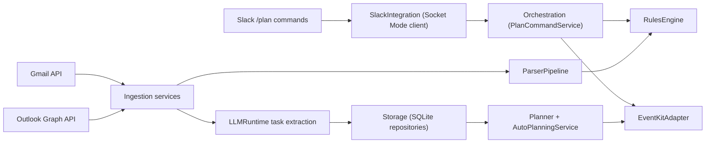

# SenseAssist

SenseAssist is a local-first macOS planning agent for students.

It ingests Gmail and Outlook updates (including UB Learns/Piazza-style notification emails), extracts actionable tasks, and generates a realistic daily plan that is written into a dedicated Apple Calendar via EventKit.

This README is an in-depth project-plan analysis and implementation snapshot aligned to `PROJECT_SPEC_V2.md`, with concrete status as of **March 1, 2026**.

## Table of contents

1. [Project mission](#project-mission)
2. [MVP scope boundaries](#mvp-scope-boundaries)
3. [Architecture and trust boundaries](#architecture-and-trust-boundaries)
4. [Primary flows](#primary-flows)
5. [Milestone scorecard vs plan](#milestone-scorecard-vs-plan)
6. [MVP backlog reconciliation](#mvp-backlog-reconciliation)
7. [What works today](#what-works-today)
8. [Known gaps and risks](#known-gaps-and-risks)
9. [Run locally](#run-locally)
10. [Live sync setup (accounts + tokens)](#live-sync-setup-accounts--tokens)
11. [LLM runtime options](#llm-runtime-options)
12. [Repository map](#repository-map)
13. [Testing and quality gates](#testing-and-quality-gates)
14. [Roadmap focus for next contributions](#roadmap-focus-for-next-contributions)

## Project mission

SenseAssist is designed around three non-negotiables:

- **Local-first execution**: ingestion, parsing, planning, and calendar mutations run on your Mac.
- **Safety-first automation**: LLM output can propose structure, but deterministic code enforces validity and side-effect boundaries.
- **Auditability and control**: revisions and operations are logged, and user-facing commands support undo.

Reference plan document: [`PROJECT_SPEC_V2.md`](./PROJECT_SPEC_V2.md)

## MVP scope boundaries

In-scope for MVP:

- Launching background helper flow on macOS with reliable runtime health.
- Continuous Gmail/Outlook ingestion with idempotent persistence.
- UB Learns/Piazza-style notification parsing and confidence gating.
- Stress-aware scheduling and dedicated managed calendar writes.
- Slack-based control loop with auditable operations and undo.

Out-of-scope for MVP:

- Public cloud backend as a runtime dependency.
- Direct UB Learns/Piazza API integrations (email remains source of truth).
- Mutation of non-agent calendar events by default.
- Fully autonomous action on low-confidence extraction.

## Architecture and trust boundaries

High-level runtime:



Trust model:

- Untrusted input: email bodies and Slack free-text.
- Deterministic boundary: parser/rules/planner/orchestration/storage/event executor.
- Mutation boundary: EventKit writes are scoped to managed SenseAssist calendar events.

## Primary flows

### Flow A: Interactive planning (Slack -> Calendar)

1. Student sends `/plan ...` command from Slack.
2. Socket Mode event is received by helper.
3. Command parser + orchestration resolve operation intent.
4. Rules validation enforces revision and ambiguity guardrails.
5. EventKit adapter mutates managed calendar blocks.
6. Slack response confirms result and revision context.

### Flow B: Background ingestion (Email -> Tasks -> Plan -> Calendar)

1. Adaptive scheduler triggers sync windows.
2. Gmail/Outlook adapters fetch incrementally using provider cursors.
3. Parser pipeline creates normalized update cards.
4. Rules confidence gates decide auto-eligible updates.
5. LLM runtime maps approved updates to task records.
6. Auto-planning service regenerates plan and applies diff to EventKit.
7. Revisions/operations are stored for audit and recovery.

## Milestone scorecard vs plan

Source of milestones: section 17 in [`PROJECT_SPEC_V2.md`](./PROJECT_SPEC_V2.md).

| Milestone | Planned outcome | Current status (Mar 1, 2026) | Notes |
| --- | --- | --- | --- |
| M0 Foundation | Shared modules, storage, logging, config | Done | Swift package modules and DB bootstrap/migrations are in place. |
| M1 Slack + Calendar core | `/plan` flow + safe calendar edits + undo | Mostly done | Socket Mode command routing and `today/add/move/undo` are wired. Full command set in spec (`lock sleep`, etc.) is not fully exposed in runtime command parser yet. |
| M2 Gmail ingestion | Incremental + idempotent sync + parser + task creation | Done for core path | Pagination, stable cursor tie-break, and upsert/idempotency are implemented. |
| M3 UB Learns/Piazza intelligence | Template logic + confidence handling + uncertain-flow gating | Partial | Deterministic classifier/tagging/digest splitting exists. LLM fallback parser and richer due-date propagation remain limited. |
| M4 Outlook + adaptive scheduler | Graph incremental sync + polling/backoff | Mostly done | Graph pagination/cursoring and adaptive scheduler loop are wired. |
| M5 Hardening + trust features | Full reliability/security polish | Partial | Audit + undo are present; launch-at-login UX, encryption-at-rest, and broader E2E coverage are still pending. |

## MVP backlog reconciliation

Source: [`Docs/GITHUB_ISSUES_MVP_BACKLOG.md`](./Docs/GITHUB_ISSUES_MVP_BACKLOG.md)

Backlog item status against current code:

- 1. Gmail incremental pagination/cursor tie-break: **resolved**
- 2. Outlook incremental pagination/cursor tie-break: **resolved**
- 3. Ingestion -> planner -> EventKit apply path: **resolved**
- 4. Slack Socket Mode command routing: **resolved**
- 5. Persist plan revision + undo across restarts: **resolved**
- 6. Adaptive scheduler in runtime loop: **resolved**
- 7. Remove dev defaults from production path: **mostly resolved** (demo accounts still exist, but demo mode-gated)
- 8. Hide demo sync flows behind dev mode: **resolved**
- 9. Replace placeholder menu app with onboarding UI: **pending**
- 10. Improve extraction fidelity/provenance/due dates: **pending**
- 11. Deterministic update content hash: **resolved**
- 12. Remove hardcoded EventKit calendar name in all paths: **pending**
- 13. Add missing E2E/regression coverage for failure modes: **pending**

## What works today

Implemented and working in this repository:

- Multi-account Gmail/Outlook ingestion with persisted per-account cursors.
- Deterministic parser pipeline:
  - trusted sender filtering
  - template classification
  - digest splitting
  - confidence and confirmation gating
- LLM extraction runtime:
  - ONNX Runtime GenAI bridge (`Scripts/onnx_genai_runner.py`) is required for live sync.
- Rules engine for stale revisions, ambiguity, and low-confidence extraction.
- Planner engine with feasibility states: `on_track`, `at_risk`, `infeasible`.
- Adaptive background sync scheduler with active/idle/error backoff states.
- EventKit-managed calendar writes through `CalendarStore` abstraction.
- Slack Socket Mode command handling to orchestration service.
- Plan command orchestration:
  - `today`, `add`, `move`, `undo`, `help`
  - revision tracking
  - operation persistence
  - undo hydration after restart
- SQLite persistence and migrations for updates/tasks/task_sources/accounts/cursors/revisions/operations/audit logs.

## Known gaps and risks

These are the main gaps between the full plan and current implementation:

- `SenseAssistMenuApp` is still a placeholder (no onboarding/account-linking UI).
- Launch-at-login integration (`SMAppService`) is not yet wired in runtime flow.
- EventKit adapter still hardcodes `"SenseAssist"` in some fetch/find/delete paths.
- Planner constraints are partly implemented:
  - workday window/cutoff/max deep-work/break spacing/buffer exist
  - explicit `sleepStart`/`sleepEnd` constraint enforcement is not fully modeled in planning windows yet
- LLM task extraction currently does not robustly propagate due dates from parsed evidence into `TaskItem.dueAtLocal`.
- Task provenance is still simplified in extraction mapping (first-update-source bias).
- SQLite is currently plain SQLite in this codebase (no SQLCipher/at-rest DB encryption wiring yet).
- Slack spec-level command surface is broader than currently exposed parser commands.
- E2E regression coverage is still focused on module/integration tests, not full live-provider failure matrices.

## Run locally

### 1) Prerequisites

- macOS 13+
- Xcode command line tools (Swift 6)
- `sqlite3` in `PATH` (optional, for DB summaries)

### 2) Validate core health

```bash
swift test
swift run senseassist-helper --health-check
```

On March 1, 2026, this suite executed 28 passing tests in this environment.

### 3) Plan command demo (calendar control path)

```bash
swift run senseassist-helper --plan 'today'
swift run senseassist-helper --plan 'add "CSE312 Assignment" 90m tomorrow 7pm'
swift run senseassist-helper --plan 'move "CSE312 Assignment" tomorrow 8pm 60m'
swift run senseassist-helper --plan 'undo'
```

If Calendar permission is missing, helper returns remediation text and does not mutate events.

### 4) Ingestion demo mode

Demo sync commands are intentionally gated:

```bash
export SENSEASSIST_ENABLE_DEMO_COMMANDS=1
swift run senseassist-helper --sync-all-demo
```

If you prefer Makefile target:

```bash
SENSEASSIST_ENABLE_DEMO_COMMANDS=1 make sync-all-demo
```

## Live sync setup (accounts + tokens)

Live sync now requires explicit enabled accounts in the `accounts` table.

### 1) Add accounts

Default DB path:

```text
~/.senseassist/senseassist.sqlite
```

Example account seed:

```bash
sqlite3 ~/.senseassist/senseassist.sqlite "
INSERT INTO accounts (account_id, provider, email, is_enabled, created_at_utc, updated_at_utc) VALUES
  ('gmail:you@gmail.com', 'gmail', 'you@gmail.com', 1, CURRENT_TIMESTAMP, CURRENT_TIMESTAMP),
  ('outlook:you@buffalo.edu', 'outlook', 'you@buffalo.edu', 1, CURRENT_TIMESTAMP, CURRENT_TIMESTAMP)
ON CONFLICT(account_id) DO UPDATE SET
  provider=excluded.provider,
  email=excluded.email,
  is_enabled=excluded.is_enabled,
  updated_at_utc=excluded.updated_at_utc;
"
```

### 2) Provide OAuth tokens (Keychain preferred; env supported)

Environment key format:

```text
SENSEASSIST_TOKEN_<PROVIDER>_<ACCOUNT_ID_OR_EMAIL_NORMALIZED>
```

Normalization:

- Replace non-alphanumeric chars with `_`
- Uppercase result

Examples:

```bash
export SENSEASSIST_TOKEN_GMAIL_GMAIL_YOU_GMAIL_COM="<gmail-access-token>"
export SENSEASSIST_TOKEN_OUTLOOK_OUTLOOK_YOU_BUFFALO_EDU="<outlook-access-token>"
```

For long-running operation (no hourly manual token updates), set refresh token + app credentials.

Refresh token env key format:

```text
SENSEASSIST_REFRESH_TOKEN_<PROVIDER>_<ACCOUNT_ID_OR_EMAIL_NORMALIZED>
```

Required app credentials for automatic refresh:

```bash
# Google
export SENSEASSIST_GMAIL_CLIENT_ID="<google-oauth-client-id>"
export SENSEASSIST_GMAIL_CLIENT_SECRET="<google-oauth-client-secret>"

# Microsoft
export SENSEASSIST_OUTLOOK_CLIENT_ID="<microsoft-app-client-id>"
export SENSEASSIST_OUTLOOK_CLIENT_SECRET="<microsoft-app-client-secret>"
# optional, defaults to "common"
export SENSEASSIST_OUTLOOK_TENANT="common"
```

Example refresh-token exports:

```bash
export SENSEASSIST_REFRESH_TOKEN_GMAIL_GMAIL_YOU_GMAIL_COM="<gmail-refresh-token>"
export SENSEASSIST_REFRESH_TOKEN_OUTLOOK_OUTLOOK_YOU_BUFFALO_EDU="<outlook-refresh-token>"
```

### 3) Run one live sync pass

```bash
swift run senseassist-helper --sync-live-once
```

Or via Makefile:

```bash
make sync-all-live
```

## LLM runtime options

### Required for live sync: ONNX Runtime GenAI

Finalized model for this repo:

- `microsoft/Phi-3.5-mini-instruct-onnx`

One-command install + setup:

```bash
make llm-install
source ./.env.onnx.local
make llm-smoke
```

This installs Python dependencies, downloads the model into:

- `Models/Phi-3.5-mini-instruct-onnx`

It also creates a local Python venv for ONNX runtime dependencies:

- `.venv-onnx`

and writes local runtime exports to:

- `.env.onnx.local`

Manual env configuration is still supported:

```bash
export SENSEASSIST_ONNX_MODEL_PATH="/absolute/path/to/model"
export SENSEASSIST_ONNX_RUNNER="/Users/DEVDESAI1/Desktop/University_at_Buffalo/Projects/SenseAssist/Scripts/onnx_genai_runner.py"
export SENSEASSIST_ONNX_PYTHON="/usr/bin/python3"
```

Optional tuning:

```bash
export SENSEASSIST_ONNX_PROVIDER="coreml"   # cpu|coreml|cuda|dml
export SENSEASSIST_ONNX_MAX_NEW_TOKENS="512"
export SENSEASSIST_ONNX_TEMPERATURE="0.2"
export SENSEASSIST_ONNX_TOP_P="0.95"
```

## Repository map

- `Sources/CoreContracts`: shared contracts, configuration, logging.
- `Sources/Storage`: SQLite store, migrations, repositories, audit log.
- `Sources/ParserPipeline`: deterministic message parsing/classification/splitting.
- `Sources/RulesEngine`: validation firewall for edits and extracted updates.
- `Sources/Planner`: scheduling heuristics and feasibility checks.
- `Sources/LLMRuntime`: ONNX extraction/edit parsing runtime (live path uses on-device ONNX Runtime GenAI).
- `Sources/Ingestion`: Gmail/Outlook services, multi-account coordinator, adaptive scheduler, auto-planning apply.
- `Sources/Integrations/Slack`: Socket Mode transport + command parsing.
- `Sources/Integrations/Gmail`: Gmail list/get + cursor logic.
- `Sources/Integrations/Outlook`: Graph messages + nextLink pagination + cursor logic.
- `Sources/Integrations/EventKitAdapter`: CalendarStore abstractions and EventKit implementation.
- `Sources/Orchestration`: `/plan` command flow, revisions, undo persistence.
- `Sources/SenseAssistHelper`: executable runtime entry point.
- `Sources/SenseAssistMenuApp`: menu app target (currently placeholder).
- `Tests/*`: module and integration tests.

## Testing and quality gates

Current test coverage areas:

- parser templates and confidence/confirmation behavior
- rules engine revision and ambiguity handling
- planner feasibility and daily cap logic
- storage bootstrap/migrations/repositories
- ingestion sync semantics (including multi-account scenarios)
- orchestration add/move/today/undo behavior and permission remediation
- adaptive scheduler interval policy

Recommended local gate before PR:

```bash
swift test
make helper-health
```

## Roadmap focus for next contributions

Highest-value remaining work:

1. Replace placeholder menu app with real onboarding + permission + account linking flows.
2. Remove remaining hardcoded managed calendar name usage in EventKit fetch/find/delete paths.
3. Expand parser/extractor fidelity:
   - robust due-date propagation
   - better source-to-task provenance mapping
4. Complete hardening track:
   - launch-at-login wiring
   - encryption-at-rest strategy
   - E2E failure-mode regression tests
5. Align runtime command surface with full spec command contract.

## Contributing

1. Fork the repo.
2. Create a branch.
3. Add tests for behavior changes.
4. Run:

```bash
swift test
```

5. Open a PR with:

- problem statement
- behavior delta
- test evidence

## License

MIT. See [`LICENSE`](./LICENSE).
