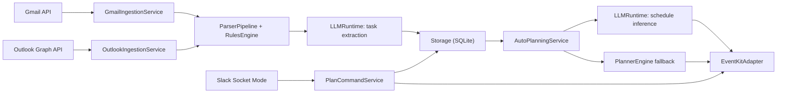

# SenseAssist

Local-first, on-device AI assistant that converts email updates into auditable calendar execution.

SenseAssist ingests Gmail and Outlook notifications, extracts actionable work, plans deep-work blocks using an on-device LLM, and applies managed updates into Apple Calendar with revisioned undo support.

## Project status (March 2, 2026)

- Stage: Beta OSS
- Platform: macOS 13+
- Language: Swift 6
- Runtime mode: local-first (no cloud dependency required for planning)
- Test status: 36/36 tests passing (`swift test`)

## Why SenseAssist

- Local-first privacy: ingestion, parsing, planning, and calendar mutation run on-device.
- Reliable automation: idempotent sync, deterministic storage state, and guarded write paths.
- Explainable operations: revision tracking, operation logs, and undo-ready plan edits.
- Multi-account support: Gmail + Outlook account-level cursors and selective enablement.

## Core capabilities

- Email ingestion:
  - Incremental Gmail sync with tuple cursor (`internalDate`, `messageID`).
  - Incremental Outlook Graph sync with tuple cursor (`receivedDateTime`, `messageID`).
  - Per-account cursor persistence and deduplicated update ingestion.
- Task intelligence:
  - Rule-based parsing for trusted sources, digest splitting, template tagging, and confidence scoring.
  - LLM extraction from approved updates into normalized `TaskItem` records.
- Scheduling:
  - On-device LLM scheduler generates `SchedulePlan` blocks.
  - Deterministic planner fallback if scheduler inference fails.
  - Feasibility state tracking: `on_track`, `at_risk`, `infeasible`.
- Execution:
  - Managed Apple Calendar writes through EventKit adapter.
  - Slack `/plan` command handling (`today`, `add`, `move`, `undo`, `help`).
  - Revision and operation persistence for audit and rollback behavior.

## Architecture


```mermaid
flowchart LR
    A["Gmail API"] --> B["GmailIngestionService"]
    C["Outlook Graph API"] --> D["OutlookIngestionService"]
    B --> E["ParserPipeline + RulesEngine"]
    D --> E
    E --> F["LLMRuntime: task extraction"]
    F --> G["Storage (SQLite)"]
    G --> H["AutoPlanningService"]
    H --> I["LLMRuntime: schedule inference"]
    H --> J["PlannerEngine fallback"]
    I --> K["EventKitAdapter"]
    J --> K
    L["Slack Socket Mode"] --> M["PlanCommandService"]
    M --> K
    M --> G
```

## Repository layout

- `Sources/CoreContracts`: shared domain models and configuration.
- `Sources/Storage`: SQLite store, migrations, repositories.
- `Sources/Ingestion`: provider ingestion and multi-account coordination.
- `Sources/ParserPipeline`: deterministic parsing + confidence signals.
- `Sources/LLMRuntime`: ONNX and Ollama runtimes, extraction/scheduling prompts.
- `Sources/Planner`: deterministic scheduling fallback engine.
- `Sources/Integrations`: Gmail, Outlook, Slack, EventKit adapters.
- `Sources/Orchestration`: `/plan` command parser/service and undo flow.
- `Sources/SenseAssistHelper`: runtime entrypoint and background loop.
- `Tests`: unit/integration tests across all modules.
- `Scripts`: model install and smoke-test utilities.

## Quick start

### Prerequisites

- macOS 13+
- Xcode Command Line Tools
- Swift 6 toolchain
- Python 3 (for ONNX runner script)

### 1) Validate build and tests

```bash
swift test
swift run senseassist-helper --health-check
```

### 2) Install and verify on-device model (Phi-3.5 ONNX)

```bash
make llm-install
source ./.env.onnx.local
make llm-smoke
```

### 3) Configure OAuth credentials (env-first)

Create `.env.oauth.local`:

```bash
export SENSEASSIST_GMAIL_CLIENT_ID="<client-id>"
export SENSEASSIST_GMAIL_CLIENT_SECRET="<client-secret>"

export SENSEASSIST_REFRESH_TOKEN_GMAIL_GMAIL_YOUR1_GMAIL_COM="<refresh-token>"
export SENSEASSIST_REFRESH_TOKEN_GMAIL_GMAIL_YOUR2_GMAIL_COM="<refresh-token>"
export SENSEASSIST_REFRESH_TOKEN_GMAIL_GMAIL_YOUR3_GMAIL_COM="<refresh-token>"

# Optional Outlook
export SENSEASSIST_OUTLOOK_CLIENT_ID="<client-id>"
export SENSEASSIST_OUTLOOK_CLIENT_SECRET="<client-secret>"
export SENSEASSIST_REFRESH_TOKEN_OUTLOOK_OUTLOOK_YOU_DOMAIN_COM="<refresh-token>"
```

Load env files automatically in `~/.zshrc`:

```bash
source /absolute/path/to/SenseAssist/.env.oauth.local
source /absolute/path/to/SenseAssist/.env.onnx.local
```

### 4) Run live sync once

```bash
make sync-all-live
make db-summary
```

## Runtime modes

- Live mode:
  - Requires enabled accounts in DB + OAuth env.
  - Requires `SENSEASSIST_ONNX_MODEL_PATH`.
  - Command: `make sync-all-live`.
- Demo mode:
  - Uses stub providers and synthetic accounts.
  - Requires explicit enable flag.
  - Command: `SENSEASSIST_ENABLE_DEMO_COMMANDS=1 make sync-all-demo`.

## Configuration and environment

- ONNX runtime:
  - `SENSEASSIST_ONNX_MODEL_PATH` (required for live sync)
  - `SENSEASSIST_ONNX_RUNNER` (default: `Scripts/onnx_genai_runner.py`)
  - `SENSEASSIST_ONNX_PYTHON` (default: `/usr/bin/python3`)
  - `SENSEASSIST_ONNX_MAX_NEW_TOKENS`, `SENSEASSIST_ONNX_TEMPERATURE`, `SENSEASSIST_ONNX_TOP_P`
- OAuth:
  - `SENSEASSIST_GMAIL_CLIENT_ID`, `SENSEASSIST_GMAIL_CLIENT_SECRET`
  - `SENSEASSIST_OUTLOOK_CLIENT_ID`, `SENSEASSIST_OUTLOOK_CLIENT_SECRET`, `SENSEASSIST_OUTLOOK_TENANT`
  - Refresh token keys:
    - `SENSEASSIST_REFRESH_TOKEN_<PROVIDER>_<NORMALIZED_ACCOUNT_KEY>`
- Credential source:
  - Default: environment-only.
  - Optional chained lookup (env then keychain): set `SENSEASSIST_USE_KEYCHAIN=1`.

## Enterprise-ready operating model

SenseAssist is intentionally built for controlled automation in security-conscious environments:

- Trust boundaries:
  - Treat email and Slack payloads as untrusted input.
  - Require validation via parser confidence + rule gates before extraction/scheduling.
- Change safety:
  - Only managed calendar blocks are modified by default.
  - All plan writes track revision and operation metadata.
- Deterministic fallback:
  - LLM scheduling path has deterministic planner fallback to preserve availability.
- Idempotent persistence:
  - Update/task upserts and cursored sync prevent duplicate data churn.

## Current known gaps

- `SenseAssistMenuApp` remains placeholder-level and not production onboarding UX.
- Full launch-at-login service integration is not complete.
- EventKit managed calendar naming has partial hardcoded default assumptions.
- Due-date propagation and source provenance in extraction can be improved.
- SQLite encryption-at-rest is not yet implemented.
- End-to-end failure-matrix tests (provider outages, token churn) are still limited.

## Commands

```bash
make help
make test
make helper-health
make llm-install
make llm-smoke
make sync-all-demo
make sync-all-live
make db-summary
```

## Project standards

- Contribution guide: `CONTRIBUTING.md`
- Security policy: `SECURITY.md`
- Code of conduct: `CODE_OF_CONDUCT.md`
- Support guide: `SUPPORT.md`
- Governance model: `GOVERNANCE.md`

## Contributing

- Open issues and roadmap source: `Docs/GITHUB_ISSUES_MVP_BACKLOG.md`
- Primary technical scope reference: `PROJECT_SPEC_V2.md`
- Submit PRs with:
  - clear problem statement
  - test coverage updates when behavior changes
  - migration notes for schema/runtime changes

## License

MIT License. See `LICENSE`.
