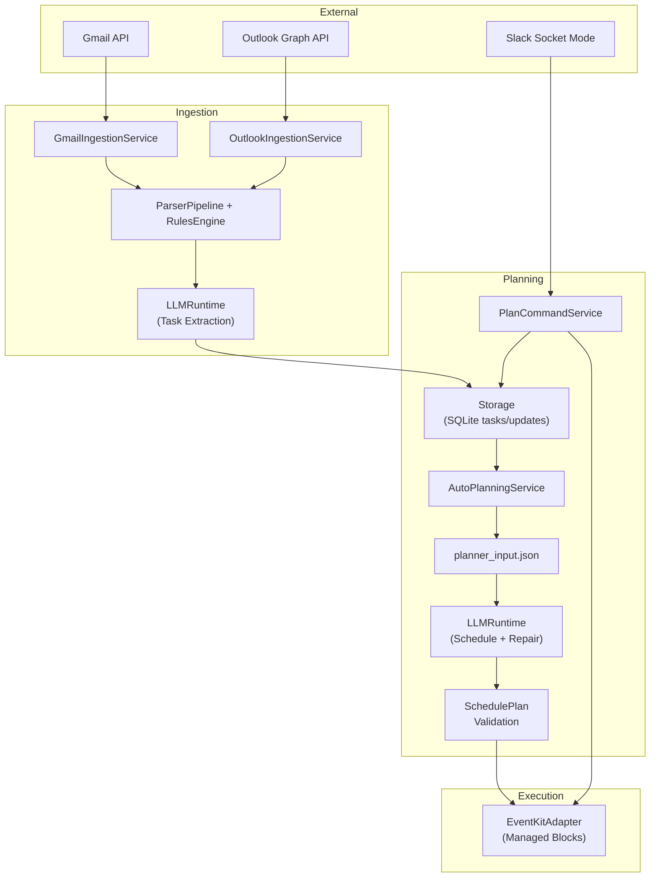

# SenseAssist

Local-first, on-device AI assistant that converts inbox updates into auditable calendar execution.

SenseAssist ingests Gmail and Outlook updates, extracts actionable work, plans deep-work blocks with an on-device LLM, and applies managed changes to Apple Calendar with revisioned history.

## Project status (March 3, 2026)

- Stage: Beta OSS
- Platform: macOS 13+
- Language: Swift 6
- Runtime mode: local-first (no cloud dependency required for planning)
- Test status: 39/39 tests passing (`swift test`)
- Full project + benchmark documentation: `PROJECT_DOCUMENTATION_2026-03-03.md`

## Why SenseAssist

- Local-first privacy: ingestion, parsing, planning, and calendar mutation run on-device.
- Reliable automation: idempotent sync, deterministic storage state, guarded write paths.
- Explainable operations: revision tracking, operation logs, undo-ready plan edits.
- Multi-account support: Gmail + Outlook account-level cursors and selective enablement.

## Core capabilities

- Email ingestion:
  - Incremental Gmail sync with tuple cursor (`internalDate`, `messageID`).
  - Incremental Outlook Graph sync with tuple cursor (`receivedDateTime`, `messageID`).
  - Per-account cursor persistence and deduplicated update ingestion.
- Task intelligence:
  - Rule-based parsing for trusted sources, digest splitting, tagging, and confidence scoring.
  - LLM extraction from approved updates into normalized `TaskItem` records.
  - Due-date repair pass when extraction misses required due dates.
- Scheduling:
  - LLM-only scheduler for auto-planning (`llm_only` mode).
  - `planner_input.json` snapshot generated before each planning run and consumed by runtime prompts.
  - Student routine task injection (LeetCode, internships, meals, hygiene, mental reset) with opt-out env flag.
  - Policy-aware scheduling prompts:
    - defer short due-soon tasks (example: due in 2 days) toward day-before-due when feasible
    - enforce daily progress on large assignments
  - Feasibility state tracking: `on_track`, `at_risk`, `infeasible`.
- Execution:
  - Managed Apple Calendar writes through EventKit adapter.
  - Slack `/plan` command handling (`today`, `add`, `move`, `undo`, `help`).
  - Revision and operation persistence for audit and rollback behavior.

## Architecture


```mermaid
flowchart TB
    subgraph External
        A["Gmail API"]
        C["Outlook Graph API"]
        M["Slack Socket Mode"]
    end

    subgraph Ingestion
        B["GmailIngestionService"]
        D["OutlookIngestionService"]
        E["ParserPipeline + RulesEngine"]
        F["LLMRuntime<br/>(Task Extraction)"]
    end

    subgraph Planning
        G["Storage<br/>(SQLite tasks/updates)"]
        H["AutoPlanningService"]
        I["planner_input.json"]
        J["LLMRuntime<br/>(Schedule + Repair)"]
        K["SchedulePlan<br/>Validation"]
        N["PlanCommandService"]
    end

    subgraph Execution
        L["EventKitAdapter<br/>(Managed Blocks)"]
    end

    A --> B
    C --> D
    B --> E
    D --> E
    E --> F
    F --> G
    G --> H
    H --> I
    I --> J
    J --> K
    K --> L
    M --> N
    N --> L
    N --> G
```

## Repository layout

- `Sources/CoreContracts`: shared domain models and configuration.
- `Sources/Storage`: SQLite store, migrations, repositories.
- `Sources/Ingestion`: provider ingestion and multi-account coordination.
- `Sources/ParserPipeline`: deterministic parsing + confidence signals.
- `Sources/LLMRuntime`: ONNX and Ollama runtime clients, extraction/scheduling prompts, response validation.
- `Sources/Planner`: deterministic planner module (kept for tests/tools, not used by auto-planning live path).
- `Sources/Integrations`: Gmail, Outlook, Slack, EventKit adapters.
- `Sources/Orchestration`: `/plan` command parser/service and undo flow.
- `Sources/SenseAssistHelper`: runtime entrypoint and background loop.
- `Tests`: unit/integration tests across modules.
- `Scripts`: model install, smoke-test, and benchmark utilities.

## Quick start

### Prerequisites

- macOS 13+
- Xcode Command Line Tools
- Swift 6 toolchain
- Python 3 (for ONNX runner script)

### 1) Validate build and tests

```bash
swift test
swift run senseassist-helper --health-check
```

### 2) Install and verify on-device model (Phi-3.5 ONNX)

```bash
make llm-install
source ./.env.onnx.local
make llm-smoke
make llm-bench
```

Benchmark reports are written to `Docs/benchmarks/` (JSON + Markdown).

## On-device benchmark results (March 3, 2026)

### Benchmark profile

| Field | Value |
| --- | --- |
| Model | `Phi-3.5-mini-instruct-onnx` (`cpu-int4-awq-block-128-acc-level-4`) |
| Suite | `standard` (`3` measured + `1` warmup per case) |
| Total measured runs | `9` |
| Timestamp (UTC) | `2026-03-03T06:14:56Z` |

### Overall metrics

| Metric | Mean | P50 | P90 | P95 | Min | Max |
| --- | ---: | ---: | ---: | ---: | ---: | ---: |
| Time to First Token (`ttft_ms`) | 0.56 ms | 0.12 | 1.00 | 2.51 | 0.07 | 4.02 |
| Total Response Latency (`total_latency_ms`) | 25,892.49 ms | 26,083.66 | 33,722.91 | 33,904.65 | 17,693.88 | 34,086.40 |
| Generation Latency (`generation_latency_ms`) | 14,820.02 ms | 15,511.31 | 20,990.17 | 21,119.31 | 8,084.75 | 21,248.45 |
| Setup Latency (`setup_latency_ms`) | 11,072.13 ms | 10,572.07 | 12,932.82 | 13,123.13 | 9,608.87 | 13,313.43 |
| Tokens Per Second (`tokens_per_second`) | 10.36 | 9.77 | 12.66 | 13.22 | 8.52 | 13.78 |
| End-to-end Tokens Per Second (`e2e_tokens_per_second`) | 5.81 | 5.71 | 7.45 | 7.63 | 4.17 | 7.81 |
| Generated Tokens | 154.33 | 192.00 | 192.00 | 192.00 | 79.00 | 192.00 |
| Subprocess Wall Latency (`subprocess_wall_latency_ms`) | 26,058.66 ms | 26,244.63 | 33,904.59 | 34,086.31 | 17,901.87 | 34,268.03 |
| Subprocess Overhead (`subprocess_overhead_ms`) | 166.17 ms | 160.97 | 186.96 | 197.48 | 132.52 | 207.99 |

### Per-scenario metrics

| Case | Success | Mean TTFT (ms) | P95 TTFT (ms) | Mean Total Latency (ms) | P95 Total Latency (ms) | Mean Tokens/s | Mean E2E Tokens/s | Mean Output Tokens |
| --- | ---: | ---: | ---: | ---: | ---: | ---: | ---: | ---: |
| `json_contract_short` | 3/3 | 0.08 | 0.10 | 18,495.14 | 18,922.84 | 9.01 | 4.28 | 79.00 |
| `task_extraction_medium` | 3/3 | 1.42 | 3.63 | 26,787.67 | 29,339.34 | 12.05 | 7.21 | 192.00 |
| `schedule_planning_long` | 3/3 | 0.18 | 0.24 | 32,394.66 | 34,040.96 | 10.03 | 5.95 | 192.00 |

### Metric definitions

| Metric | Definition |
| --- | --- |
| `ttft_ms` | Elapsed time from generation start to first generated token. |
| `tokens_per_second` | `generated_tokens / generation_latency`. |
| `total_latency_ms` | Setup + generation + decode latency inside the runner. |
| `e2e_tokens_per_second` | `generated_tokens / total_latency`. |

### Benchmark commands

| Purpose | Command |
| --- | --- |
| Re-run benchmark | `make llm-bench` |
| Re-run with pinned output files | `bash Scripts/benchmark_phi35_instruct_onnx.sh --suite standard --runs 3 --warmup-runs 1 --max-new-tokens 192 --output-json Docs/ON_DEVICE_MODEL_BENCHMARK.json --output-markdown Docs/ON_DEVICE_MODEL_BENCHMARK.md` |

### 3) Configure OAuth credentials (env-first)

Create `.env.oauth.local`:

```bash
export SENSEASSIST_GMAIL_CLIENT_ID="<client-id>"
export SENSEASSIST_GMAIL_CLIENT_SECRET="<client-secret>"

export SENSEASSIST_REFRESH_TOKEN_GMAIL_GMAIL_YOUR1_GMAIL_COM="<refresh-token>"
export SENSEASSIST_REFRESH_TOKEN_GMAIL_GMAIL_YOUR2_GMAIL_COM="<refresh-token>"
export SENSEASSIST_REFRESH_TOKEN_GMAIL_GMAIL_YOUR3_GMAIL_COM="<refresh-token>"

# Optional Outlook
export SENSEASSIST_OUTLOOK_CLIENT_ID="<client-id>"
export SENSEASSIST_OUTLOOK_CLIENT_SECRET="<client-secret>"
export SENSEASSIST_REFRESH_TOKEN_OUTLOOK_OUTLOOK_YOU_DOMAIN_COM="<refresh-token>"
```

Load env files for the current shell:

```bash
source /absolute/path/to/SenseAssist/.env.oauth.local
source /absolute/path/to/SenseAssist/.env.onnx.local
```

### 4) Run live sync once

```bash
make sync-all-live
make db-summary
```

## Runtime modes

- Live mode:
  - Requires enabled accounts in DB + OAuth env.
  - Requires `SENSEASSIST_ONNX_MODEL_PATH`.
  - Command: `make sync-all-live`.
- Demo mode:
  - Uses stub providers and synthetic accounts.
  - Requires explicit enable flag.
  - Command: `SENSEASSIST_ENABLE_DEMO_COMMANDS=1 make sync-all-demo`.

## LLM scheduling configuration

- Scheduler mode:
  - `SENSEASSIST_LLM_SCHEDULER_MODE`
  - Current supported value: `llm_only` (default).
- Planner input snapshot:
  - `SENSEASSIST_PLANNER_INPUT_PATH` (optional absolute/tilde path).
  - Default: `<db_directory>/planner_input.json`.
  - Snapshot is written before every auto-planning run and then consumed by scheduling prompts.
- Daily routine tasks:
  - `SENSEASSIST_ENABLE_DAILY_ROUTINE_TASKS` (default enabled).
  - Set `0`, `false`, or `no` to disable injected routine tasks.
- ONNX runtime:
  - `SENSEASSIST_ONNX_MODEL_PATH` (required for live sync).
  - `SENSEASSIST_ONNX_RUNNER` (default: `Scripts/onnx_genai_runner.py`).
  - `SENSEASSIST_ONNX_PYTHON` (default: `/usr/bin/python3`).
  - `SENSEASSIST_ONNX_MAX_NEW_TOKENS`, `SENSEASSIST_ONNX_TEMPERATURE`, `SENSEASSIST_ONNX_TOP_P`.
  - `SENSEASSIST_ONNX_PROVIDER` (optional provider hint for runner).
- OAuth:
  - `SENSEASSIST_GMAIL_CLIENT_ID`, `SENSEASSIST_GMAIL_CLIENT_SECRET`.
  - `SENSEASSIST_OUTLOOK_CLIENT_ID`, `SENSEASSIST_OUTLOOK_CLIENT_SECRET`, `SENSEASSIST_OUTLOOK_TENANT`.
  - Refresh token key format: `SENSEASSIST_REFRESH_TOKEN_<PROVIDER>_<NORMALIZED_ACCOUNT_KEY>`.
- Credential source:
  - Default: environment-only.
  - Optional chained lookup (env then keychain): `SENSEASSIST_USE_KEYCHAIN=1`.

## `planner_input.json` example

```json
{
  "meta": {
    "generated_at_utc": "2026-03-03T14:02:11Z",
    "planning_date_local": "2026-03-03",
    "time_zone": "America/New_York",
    "plan_revision": 42
  },
  "constraints": {
    "day_start_local": "2026-03-03T09:00:00-05:00",
    "day_end_local": "2026-03-03T21:00:00-05:00",
    "max_deep_work_minutes_per_day": 240,
    "break_every_minutes": 90,
    "break_duration_minutes": 10,
    "free_space_buffer_minutes": 45,
    "sleep_window": {
      "start": "00:30",
      "end": "08:00"
    }
  },
  "busy_blocks": [
    {
      "title": "Lecture: CSE 331",
      "start_local": "2026-03-03T10:00:00-05:00",
      "end_local": "2026-03-03T11:20:00-05:00",
      "lock_level": "locked",
      "managed_by_agent": false
    }
  ],
  "tasks": [
    {
      "task_id": "c4f111f4-2ecf-4628-a23e-a639547f2f89",
      "title": "Short Assignment",
      "category": "assignment",
      "due_at_local": "2026-03-05T17:00:00-05:00",
      "estimated_minutes": 60,
      "min_daily_minutes": 30,
      "priority": 4,
      "stress_weight": 0.2,
      "confidence": 0.92,
      "is_large_assignment": false,
      "should_defer_until_day_before_due": true,
      "sources": [
        {
          "provider": "gmail",
          "account_id": "gmail:student@buffalo.edu",
          "message_id": "18a1d8f7b90",
          "confidence": 0.92
        }
      ]
    },
    {
      "task_id": "590cf2b6-ad2d-4f6c-a5a0-0deec2188bb3",
      "title": "Large Assignment",
      "category": "assignment",
      "due_at_local": "2026-03-15T23:00:00-04:00",
      "estimated_minutes": 480,
      "min_daily_minutes": 120,
      "priority": 4,
      "stress_weight": 0.4,
      "confidence": 0.89,
      "is_large_assignment": true,
      "should_defer_until_day_before_due": false,
      "sources": [
        {
          "provider": "outlook",
          "account_id": "outlook:student@university.edu",
          "message_id": "AAMkADk3YQ",
          "confidence": 0.89
        }
      ]
    }
  ]
}
```

## Reliability model

SenseAssist is built for controlled automation with explicit validation:

- Untrusted input handling:
  - Email and Slack payloads are treated as untrusted until parser confidence and rule gates pass.
- Strict LLM scheduling path:
  - Auto-planning requires LLM scheduler availability (`llm_only`).
  - No deterministic scheduler fallback in the live auto-planning path.
- Output hardening:
  - LLM extraction and schedule generation use multi-attempt repair prompts on invalid output.
  - Schedule output is validated against time-window, overlap, and constraint rules before calendar writes.
- Auditable mutations:
  - Managed calendar-only writes.
  - Revision and operation logs for traceability and undo behavior.

## Current known gaps

- `SenseAssistMenuApp` remains placeholder-level and not production onboarding UX.
- Full launch-at-login service integration is not complete.
- Live helper currently wires ONNX runtime path by default (Ollama runtime exists but is not the default live wiring).
- SQLite encryption-at-rest is not yet implemented.
- End-to-end failure-matrix tests (provider outages, token churn) are still limited.

## Commands

```bash
make help
make test
make helper-health
make llm-install
make llm-smoke
make llm-bench
make sync-all-demo
make sync-all-live
make db-summary
```

## Project standards

- Contribution guide: `CONTRIBUTING.md`
- Security policy: `SECURITY.md`
- Code of conduct: `CODE_OF_CONDUCT.md`
- Support guide: `SUPPORT.md`
- Governance model: `GOVERNANCE.md`

## Contributing

- Open issues and roadmap: GitHub Issues.
- Primary technical scope reference: `PROJECT_SPEC_V2.md`.
- Submit PRs with:
  - clear problem statement
  - test coverage updates when behavior changes
  - migration notes for schema/runtime changes

## License

MIT License. See `LICENSE`.
